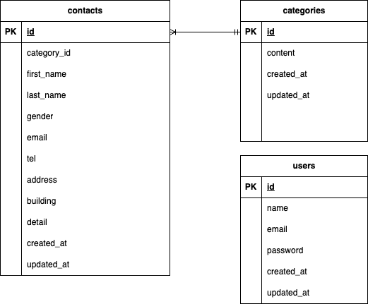

# test_contact-form

Dockerビルド

・git clone git@github.com:ma-mmaru/test_contact-form.git
・docker compose up -d --build

Laravel環境構築

・docker compose exec php bash
・composer install
・cp .env.example .env 環境変数を適宜変更
・php artisan key:generate
・php artisan migrate
・php artisan db:seed

開発環境

・お問い合わせ画面：http://localhost/
・ユーザー登録：http://localhost/register
・管理画面：http://localhost/admin
・phpMyAdmin：http://localhost:8080/

使用技術(実行環境)
・PHP 8.5.1
・Laravel 12.53.0
・Mysql 9.6.0
・nginx 1.29.4

